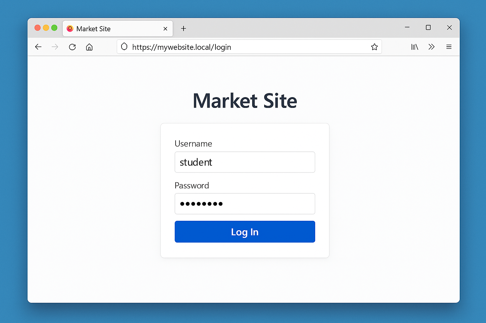
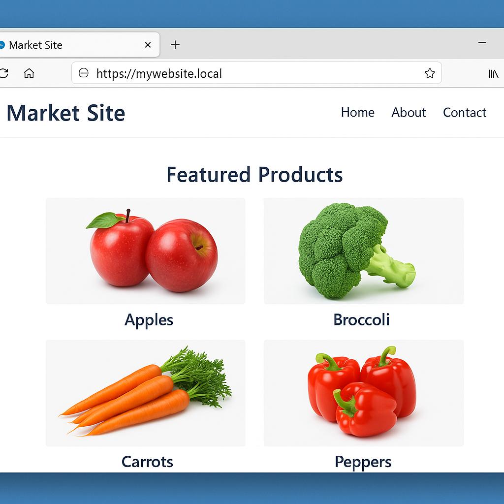

# Lab Document Template

You will write a lab document as part of the [AIA Group Project](syllabus.md#group-project). This template serves as a style guide for authoring this document for your project.

---

## The Impossible Lab

*by: The IMF (Ethan Hunt, Ilsa Faust, Luther Stickell, and Benji Dunn)*

```markdown
<!-- Of course, replace this sample text with your title and team members.

     Also, change the title to a # heading. The current markup (##) is to
     allow MkDocs to generate a table of contents. -->
```

Start with an overview of your lab. Introduce the topic and explain why it is relevant, useful, and/or applicable to the course topics.

```markdown
<!-- If possible, try to incorporate an outside source or reference that
     highlights or helps explain the reason for this particular lab topic. -->
```

&hellip;This lab incorporates recommendations provided by [NIST Special Publication 800-63B](https://pages.nist.gov/800-63-4/sp800-63b.html).

or,

&hellip;For more information on Wireshark, check out the [official Wireshark homepage](https://www.wireshark.org/).

## Learning Objectives

- Implement an access control list in a VyOS router.
- Learning objective #2.
- Learning objective #3.

| 💡 TIP |
| --- |
| Use Bloom's Taxonomy where possible. Bloom’s Taxonomy is a guide that shows how learning builds from remembering facts to creating new ideas. Check out Vanderbilt University’s Center for Teaching guide for a brief explanation: [Bloom's Taxonomy](https://cft.vanderbilt.edu/wp-content/uploads/sites/59/Blooms-Taxonomy.pdf). |

## Student Expectations

- Students should be familiar with command-line operations.
- Student expectation #2.
- Student expectation #3.

## Scenario

Every good lab guide needs a scenario to introduce the topic, problem, or tool. Be creative. Add a network diagram or other artifacts here to provide clarity on the lab environment before you list the various systems and credentials below.

## System Tools and Credentials

```markdown
<!-- Replace the systems and credentials in the table below with ones that are
     relevant to your lab. If the student will not interact with a system or
     application directly, then you do not need to list its credentials here. -->
```

| system      | description/URL           | username | password |
| ----------- | ------------------------- | -------- | -------- |
| Kali        | Kali                      | student  | tartans  |
| Ubuntu      | Ubuntu                    | student  | tartans  |
| Windows     | Windows 10                | student  | tartans  |
| Market Site | `https://mywebsite.local` | student  | tartans  |

```markdown
<!-- Wrapping a URL in the backtick symbol (`) prevents the link from becoming
     a clickable object within the guide. URLs that pertain to in-lab items
     should not be clickable in the document, as they are not accessible
     outside of the lab environment. -->
```

```markdown
<!-- Notes like the one below may or may not be needed. If your lab requires a
     callout like the one below you can make it stand out with this example.
     Feel free to try different unicode characters for different purposes. -->
```

| &#9888; NOTE |
|---|
| You are given access to the remote systems in this lab. In real-world scenarios, threat actors gain access through a variety of means such as phishing, using weak or compromised credentials, and exploiting vulnerabilities. |

See the end of this template for [more examples of callouts and in-line symbols](#icon-styled-callouts-using-html-entities).

## Phase/Section 1: First Phase/Section of the Lab

```markdown
<!-- Phases or sections signify the major tasks you expect the student to
     complete or the major milestones you expect them to reach. Phases or
     sections can be further made up of subsections that signify minor
     tasks with multiple steps each. -->
```

### Phase/Section 1 Introduction

Provide an introduction to the first phase or section of your lab. This should inform the student on the purpose of the phase/section in one or two sentences.

### The First Task of Phase/Section 1

Please provide a description of what the student is expected to complete first in Phase/Section 1 of your lab.

Steps should be actions. If the student is not performing an action, additional explanation text should not be a numbered item.

A numbered item indicates doing something, whereas normal text provides information on the previous step's results or the step that follows.

For example:

1. Write your step-by-step instructions using numbered lists to show step-by-step actions.
    - Use a `-` to indicate a sub-step or explanation of the numbered step.

2. Open the Ubuntu VM, then launch **Firefox** using the Desktop shortcut.
    - The Firefox icon is located to the left.

3. (**Ubuntu**) Navigate to the market site at `https://mywebsite.local` and logon with credentials `student|tartans`.

    

    ```markdown
    <!-- This a great place to include a screenshot of the webpage. The screenshot
         helps the student confirm they are looking at the correct item. -->
    ```

    The webpage displays items for sale from the fictitious company.  `Not an action, so it does not get a number. It's just describing the expected result.`

4. (**Ubuntu**) Find the item named "Carrots" add it your cart, and then click the **Checkout** button.

    

Next, you will open the web developer tools to manipulate the number of items in your cart by sending a POST to the page.

```markdown
<!-- Sometimes it is helpful to communicate which machine or terminal session
     should be used for certain steps. These can be annotated in each step
     inside parentheses like steps 3-4 above. -->
```

### The Second Task of Phase/Section 1

Please provide a description of what the student is expected to complete next in Phase/Section 1 of your lab. Write instructions using numbered lists to show step-by-step actions.

```markdown
<!-- Use fenced code blocks and syntax highlighting for a block of code.
     For example: -->
```

1. (**Windows**) Create an empty notepad file with the following contents and save it to the Desktop with the name `powershell-script.ps1`.

```powershell
$info = @{
    'Hostname' = hostname;
    'User' = whoami;
    'IP' = (hostname -I);
} | ConvertTo-Json;

Invoke-WebRequest -Uri 'http://<YOUR_IP_HERE>:8080' `
    -Method Post `
    -Body $info `
    -ContentType 'application/json'
```

```markdown
<!-- Notes like the one below may or may not be needed. If your lab guide
     requires a callout like the one below please create it the same way. -->
```

| &#129513; WHAT'S THAT SCRIPT DOING? |
| --- |
| The `powershell-script.ps1` script collects the system’s hostname, current user, and IP address, converts the data to JSON, and sends it via an HTTP POST request to a specified server  |

### Knowledge Check

**Knowledge Check/Quiz Question 1:** *Format knowledge check questions like this. Your knowledge check questions are best placed at the point where the student would be able to answer them as they follow along with the lab guide. Quizzes should typically be contained to a single phase or section of the lab.*

**Knowledge Check/Quiz Question 2:** *What port (number) must the webserver use to receive the data sent by the PowerShell script above?*

Knowledge checks or quiz questions should be used to assess and reinforce understanding of the lab material, or can be used to promote analysis of lab artifacts. Be clear about the expected format of the answers and ensure questions are easy to understand.

Examples might include:

- What version of XZ Utils is running on the compromised system (x.x.xx)?
- How many users currently exist in the domain (number)?
- What is the IP address of the sender in the packet capture?
- Which of the command-line tools introduced in the lab can be used to parse binary files?

Bad question types include:

- What tool did you just run? _(Doesn't assess anything of value.)_
- Why did we just run that tool? _(Too open-ended.)_
- What is the name of the log file used 7 steps ago? _(Not relevant to the current task. Does the answer need the extension, the full path, is it case-sensitive, etc.?)_
    - A better question: "Which log file receives information regarding SSH login attempts?" _(Script should allow for auth.log *and* auth as the possible answers. This question leads them to the next answer.)_
    - A follow-up question: "What is the username that attempted to login via SSH?"

### The Third Task of Phase/Section 1

Continue to provide instruction and explanation on what the student is expected to complete in Phase/Section 1 of your lab. Write instructions using numbered lists to show step-by-step actions.

2. (**Windows**) Open PowerShell from the Start Menu.

3. (**Windows**, **PowerShell**) Run the PowerShell script that you created in the previous steps with the following command:

    ```powershell
    ./powershell-script.ps1
    ```

    ```markdown
    <!-- This a great place to include another screenshot of the output of
         the command.  The screenshot helps the student confirm the process
         completed as intended. -->
    ```

**Knowledge Check/Quiz Question 3:** *Answer a question regarding the results of the script.*

## Phase/Section 2: Second Phase/Section of Skilling Lab X

### Phase/Section 2 Introduction

Please provide an introduction to the second phase or section of your lab. This should inform the student on the purpose of the phase/section in one or two sentences.

### The First Task of Phase 2

Please provide a description of what the student is expected to complete first in Phase/Section 2 of Skilling Lab X.

1. Write instructions using numbered lists to show step-by-step actions.
    - Use a `-` to indicate a sub-step or explanation of the numbered step.

### Grading Check

Provide information on how the student runs the script, what the script is doing, and what the outcome should be. If the script does not pass, what can they check to resolve the failure and try again. I.e. help get them back on track to pass the check.

Grading checks should be used to ensure a student has completed some task successfully and/or to ensure they have the correct lab state before advancing to the next task. Think of these as gate checks. Use grading checks to assess major milestones and try to be as targeted as possible.

Examples might include:

- Was a firewall rule implemented correctly? _(The check should try to connect to the specific port/service and validate whether the connection makes it through or fails.)_
- Did the student properly configure the Apache website? _(The check should try to retrieve the contents from the proper `URL:port` with a wget or curl and validate that the content is accessible and accurate.)_
- Strive to check the "thing" that gets to the heart of what you asked the student to do, but also ensures the correct state before proceeding to the next task.

## Repeat the above structure as needed until you have a complete lab guide

### Conclusion

By completing this lab you...

*Insert what the student has done or learned in the lab. Why was this topic important or useful? What is/are the key takeaway(s) you want the student to remember.*

During this lab, you:

- Performed *an action* using *a technique*.
- Achieved *a goal* by applying *a skill*.

| 💡 TIP |
| --- |
| Use Bloom's Taxonomy where possible. |

And those things are important because...

*Reinforce the importance of what was learned in the lab as a final statement.*

### References

```markdown
<!-- Include a bulleted list of helpful resources or the references cited/used
     in your lab in IEEE format. Replace the list of references below with your
     list. -->
```

- [1] P. A. Grassi et. al., "Digital Identity Guidelines: Authentication and Lifecycle Management," NIST Special Publication 800-63B, National Institute of Standards and Technology, Gaithersburg, MD, USA, Aug. 2025. [Online]. Available: <https://pages.nist.gov/800-63-4/sp800-63b.html>. [Accessed: 4 Sep. 2025].

- [2] Wireshark Foundation, "Wireshark: The world's leading network protocol analyzer," Wireshark.org, [Online]. Available: <https://www.wireshark.org>. [Accessed: 4 Sep. 2025].

## Why Markdown?

Markdown is a lightweight markup language that allows anyone to add simple formatting elements to plaintext documents. More information about Markdown, including the syntax guide, [can be found here](https://markdownguide.org).

## Styling Text

|Style|When to Use|Example|
|---|---|---|
|**bold**|Useful for directing the user's attention. Perfect for emphasizing system names, application credentials, and buttons where the user should click.|"Click the **File** menu and then ***Open&hellip;***."|
|*italics*|Can be used for more subtle callouts, like tabs in an interface, terms that are being defined for the first time, and other emphasis that doesn't need bold.|"A _pod_ is the smallest schedulable unit in Kubernetes."|
|`code`| Used for terminal commands, filenames and paths, and source code using three backticks (<code>```</code>).|"Run `kubectl get pods` to display a list of running pods."|

## In-line Icons

Icons that can be used in-line to emphasize or make clear actions the reader should take.

| Symbol | HTML Entity | Name              |
| ------ | ----------- | ----------------- |
| ☰      | `&#9776;`   | "Hamburger Menu"  |
| ⋮      | `&#8942;`   | Vertical Ellipsis |
| ✅      | `&#9989;`   | Green Checkmark   |
| ❌      | `&#10060;`  | Red X             |
| 🚫      | `&#128683;` | Not Permitted     |

## Icon-styled Callouts Using HTML Entities

Use these callouts to point out important information, warnings, tips, and actions the reader should not miss in your skilling lab guide.

### ℹ️ NOTE

```markdown
| &#8505; NOTE                                                          |
| --------------------------------------------------------------------- |
| This is a general reminder or note you want students to keep in mind. |
```

| ℹ️ NOTE                                                                |
| --------------------------------------------------------------------- |
| This is a general reminder or note you want students to keep in mind. |

### ⚠️ WARNING

```markdown
| &#9888; WARNING |
|---|
| This is a warning about something that could break, fail, or cause a problem. |
```

| ⚠️ WARNING                                                    |
| ------------------------------------------------------------ |
| This is a warning about something that could break, fail, or cause a problem. |

### 🔍 INFORMATION

```markdown
| &#128270; INFORMATION |
|---|
| This is important background information or context directly related to the lab content. |
```

| 🔍 INFORMATION                                               |
| ----------------------------------------------------------- |
| This is important background information or context directly related to the lab content. |

### 🔧 TOOL TIP

```markdown
| &#128736; TOOL TIP |
|---|
| This is a helpful trick or setting related to the tool the student is using in the lab. It can also be used to provide additional details about a specific tool or script being used. |
```

| 🔧 TOOL TIP                                                   |
| ------------------------------------------------------------ |
| This is a helpful trick or setting related to the tool the student is using in the lab. It can also be used to provide additional details about a specific tool or script being used. |

### 🧩 KEY POINT

```markdown
| &#129513; KEY POINT |
|---|
| Highlight a key piece of information that "puts the pieces" together in the lab. |
```

| 🧩 KEY POINT                                    |
| ---------------------------------------------------------- |
| Highlight a key piece of information that "puts the pieces" together in the lab. |

### 📌 REMEMBER

```markdown
| &#128204; REMEMBER |
|---|
| This is an important item to keep handy or use again later in the lab. |
```

| 📌 REMEMBER                                                  |
| ----------------------------------------------------------- |
| This is an important item to keep handy or use again later in the lab. |

### 💭 RECALL

```markdown
| &#128493; RECALL |
|---|
| This would be used to reference back to something taught previously whether it be earlier in the lab or a previous lab |
```

| 💭 RECALL |
|---|
| This would be used to reference back to something taught previously whether it be earlier in the lab or a previous lab |
